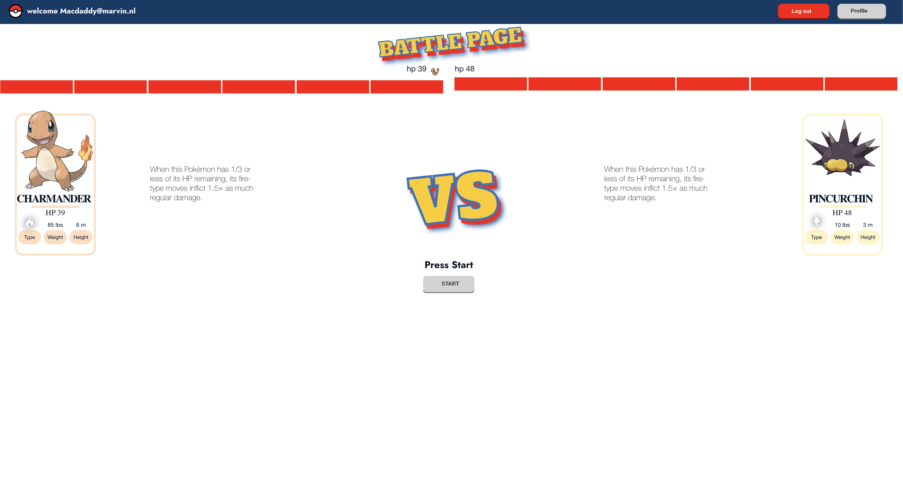

# Inleiding

Als ouder heb je soms ff een moment voor jezelf om tijd te spenderen aan iets waar je geen hersenkracht voor nodig hebt. Daarom is deze applicatie ontwikkeld omdat ik als developer het belangrijk vind dat jij als gebruiker alle 152 Pokemons leert kennen. Aangezien het een deel uitmaakt van jou leuke jaren(of je neemt het moment nu om ooit geintroduceerd te worden aan Pokemons). Er is een kleine wikipedia om te zien wie de sterkere is, en het is ook fijn om te strestest welke Pokemon sterker is dan een andere door middel van "Best of six". Dit battle systeem is opgezet als card turn based game.

[De link naar de Github repository](https://github.com/mrwinter09/pokemon2023)

# Screenshot



# Benodigheden

## Applicatie draaien

Als je het project gecloned hebt naar jouw locale machine, installeer je eerst de `node_modules` door het volgende
commando in de terminal te runnen:

```
npm install
```

Wanneer dit klaar is, kun je de applicatie starten met behulp van:

```
npm start
```

This project was bootstrapped with [Create React App](https://github.com/facebook/create-react-app).

# Overige commando's

In de voorgaande opdrachten heb je jouw ontwikkelwerk afgerond. Om ervoor te zorgen dat ook andere ontwikkelaars jouw project kunnen gebruiken, is het belangrijk een installatiehandleiding te schrijven waarin beschreven wordt wat zij hiervoor nodig hebben. Je schrijft jouw installatiehandleiding voor een mede-developer, maar zorgt ervoor dat dit ook te volgen is wanneer deze persoon geen enkele ervaring heeft binnen het frontend-landschap.<br>
Het bevat:<br>
● Een inleiding met korte beschrijving van de functionaliteit van de applicatie en screenshot van
de belangrijkste pagina van de applicatie.<br>
● Lijst van benodigdheden om de applicatie te kunnen runnen (zoals runtime environments, een
API key of gegevens van een externe backend). Let op: je vraagt de nakijkende docent nooit zelf
een API key aan te maken. Jij levert zelf jouw API key aan in de handleiding;<br>
● Een stappenplan met daarin installatie instructies.<br>
● Met welke gegevens er ingelogd kan worden indien er al accounts beschikbaar zijn.<br>
● Welke andere npm commando’s er nog beschikbaar zijn in deze applicatie en waar deze voor
dienen.<br>
